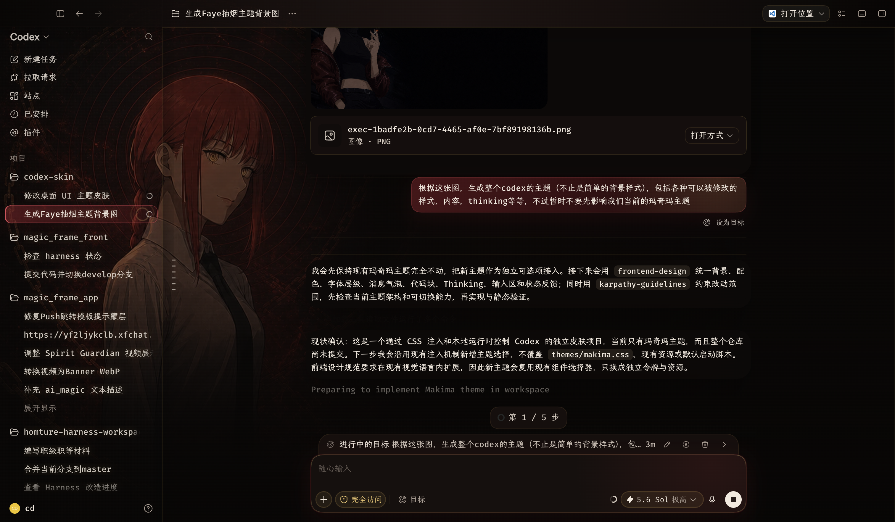

# Codex Skin Studio

> 非官方项目，与 OpenAI 无隶属、赞助或背书关系。

Codex Skin Studio 是 macOS Codex Desktop 的可逆外置主题运行时。它提供原生主题控制台、动态主题包、可分发的 `customize-codex-theme` Skill，以及从生成背景到安装、验证和恢复的一整套自动化流程。

它不会修改官方 `Codex.app`、`app.asar`、代码签名、普通 Chromium profile 或 `~/.codex`。主题通过独立 profile 和只绑定 `127.0.0.1` 的临时 CDP 运行；停止主题后会撤销注入并关闭该主题自己的隔离实例。



## 最快使用：把 Skill 交给 Codex

从 [GitHub Releases](https://github.com/ssyamv/codex-skin/releases) 下载 `customize-codex-theme-<version>.zip`，校验 `SHA256SUMS` 后，将其中的 `customize-codex-theme/` 放入：

```text
$CODEX_HOME/skills/
```

未设置 `CODEX_HOME` 时通常是 `~/.codex/skills/`。重新打开 Codex 后，可以直接说：

```text
使用 $customize-codex-theme，生成一个深蓝轨道舷窗主题，右侧留出安静阅读区，并自动安装验证。
```

```text
使用 $customize-codex-theme，把这张本地图片原样作为背景，不要重新生成，创建浅色主题并安装。
```

Skill 会：

1. 新生成或视觉修改背景时强制使用 `imagegen`；已有图片要求原样使用时保持字节不变。
2. 从 Release 安装与当前 Mac 架构匹配的 Codex Skin Studio App。
3. 生成 schema-1 主题包并依次执行 `themes validate`、`themes install`、`doctor`、`verify`。
4. 普通 Codex 正在运行时只完成离线安装，不自动退出或启动实例。
5. 失败时按精确主题执行停止、恢复和移除，不扩大删除范围。

## 安装 App

Release 提供：

- `Codex-Skin-Studio-<version>-macos-arm64.zip`：Apple Silicon；
- `Codex-Skin-Studio-<version>-macos-x64.zip`：Intel Mac；
- `customize-codex-theme-<version>.zip`：可独立分发的 Skill；
- `SHA256SUMS`：所有 Release 资产的 SHA-256。

Skill 中的安装器默认安装到 `~/Applications/Codex Skin Studio.app`：

```bash
.agents/skills/customize-codex-theme/scripts/install-app.zsh --print-plan
.agents/skills/customize-codex-theme/scripts/install-app.zsh
```

安装器先在临时目录完成校验和、ZIP、代码签名和 Bundle ID 检查，再移动旧 App 并运行 post-install doctor；任何后置检查失败都会恢复旧 App。它不使用提权，也不关闭 Gatekeeper 或主动移除 quarantine。

### 签名限制

默认 GitHub Release 在未配置 Apple 凭据时使用 ad-hoc 签名且未 notarize，macOS 可能阻止首次打开。请先核对 `SHA256SUMS`，然后在 Finder 中对 App 使用“右键 → 打开”并确认来源；不要全局关闭 Gatekeeper。

只有仓库同时配置以下 Secrets 时，Release workflow 才会执行 Developer ID 签名与 Apple notarization：

```text
MACOS_CERTIFICATE_P12_BASE64
MACOS_CERTIFICATE_PASSWORD
MACOS_SIGNING_IDENTITY
APPLE_ID
APPLE_TEAM_ID
APPLE_APP_SPECIFIC_PASSWORD
```

Release notes 会明确标注实际签名状态。

## 从源码构建

要求 macOS 14+、官方 Codex Desktop、Node.js 22+ 与 Swift 5 工具链：

```bash
git clone https://github.com/ssyamv/codex-skin.git
cd codex-skin
npm run verify
npm run test:swift
npm run build:app
```

输出为 `dist/Codex Skin Studio.app`，包含当前架构的 Swift 可执行文件、Node.js 22 运行时、CLI 与内置主题包。

## 动态主题 CLI

源码目录可运行：

```bash
./codex-skin themes list --json
./codex-skin themes validate ./my-theme --json
./codex-skin themes install ./my-theme --json
./codex-skin themes install ./my-theme --replace --json
./codex-skin start --theme my-theme
./codex-skin doctor --theme my-theme --json
./codex-skin verify --theme my-theme --json
./codex-skin snapshot --theme my-theme --output ./my-theme-runtime.png
./codex-skin stop --theme my-theme
./codex-skin themes remove my-theme --json
```

用户主题安装在：

```text
~/Library/Application Support/Codex Skin Studio/Themes/<theme-id>
```

每个主题有独立运行目录和 profile。App 从 CLI 动态读取主题列表，因此安装第三个或更多主题不需要重新编译 Swift App。

主题包结构：

```text
my-theme/
├── theme.json
├── theme.css
├── hero.png|jpg|webp
└── preview.png|jpg|webp
```

完整 schema、颜色配置、安全约束和恢复矩阵见 [Skill 契约](.agents/skills/customize-codex-theme/references/theme-contract.md)。

## 安全模型

- 官方 Codex Bundle ID、Apple Team 签名和关键文件哈希在运行前后都会验证。
- 普通 Codex 未退出时拒绝启动主题实例，工具不会代为终止它。
- CDP 只接受本机 `app://-/index.html` target，端口只绑定回环地址。
- CSS 安全检查拒绝字体、字号、行高、字距、布局、隐藏、指针和持久动画修改。
- 主题只改变颜色、背景与受控装饰，不移动、替换或隐藏业务 DOM。
- 运行目录必须存在精确所有权标记；清理操作遇到目录或主题不匹配会拒绝执行。

CDP 本身具备较高权限。不要把调试端口改为 `0.0.0.0`，也不要允许不可信程序访问该端口。

## 恢复与卸载

停止隔离主题，不删除主题包：

```bash
./codex-skin stop --theme my-theme
./codex-skin uninstall --theme my-theme
```

删除用户主题包：

```bash
./codex-skin stop --theme my-theme
./codex-skin themes remove my-theme --json
```

`uninstall` 会保留独立 profile，避免误删登录数据。`themes remove` 拒绝删除内置主题或仍在运行的主题。

## 验证与发布

```bash
npm run verify
npm run test:swift
npm run validate:skill
npm run build:app
npm run test:release
```

CI 在 macOS 上运行 Node 回归、Swift 动态模型测试、Skill 契约、App 构建和 Release 打包。标签 `v*` 会分别在 arm64 与 x64 runner 构建，并发布两个 App ZIP、一个 Skill ZIP 和统一校验和。

## 许可证与素材

源码使用 [MIT License](LICENSE)。本项目为非官方工具；视觉素材不自动包含在 MIT 代码授权中，除非素材自身或来源另有明确说明。生成、导入、使用或再分发素材前，请确认你拥有相应权利，详见 [NOTICE](NOTICE)。
